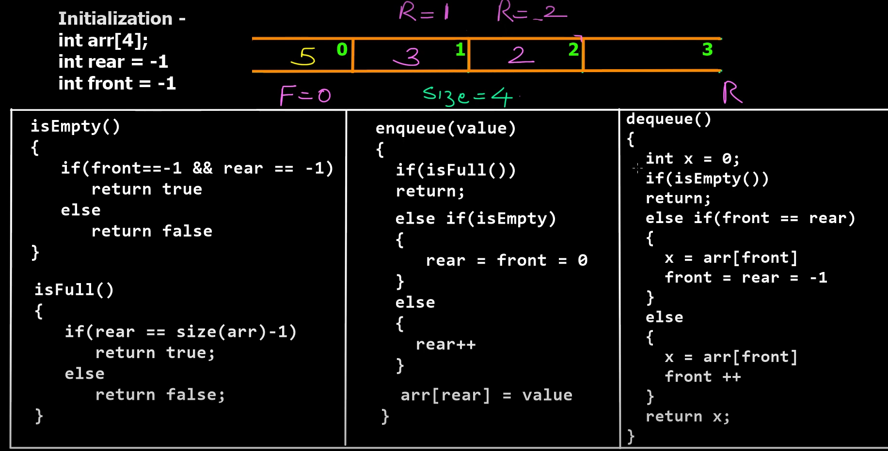

## **Definition –**

Queue is a linear data structure which operates in a **First IN First OUT or Last IN Last OUT.** Queue is an abstract data type with a bounded (predefined) capacity. It is a simple data structure that allows adding and removing elements in a particular order.
**The order is FIFO(First IN First OUT) or LILO(Last In Last Out).**

**It is named queue as it behaves like a real-world queue for examples –**

- queue(line) of cars in a single lane,
- queue of people waiting at food counter etc.

## **Standard Queue Operations –**

- Enqueue() – Add item to the queue from the REAR.
- Dequeue() – Remove item from the queue from the FRONT.
- isFull() – Check if queue is full or not.
- isEmpty() – Check if queue empty or not.
- count() – Get number of items in the queue.
- peek() – view front elemenet in a line

 

### **Step 1:** [Watch this introductory video on apna college](https://youtu.be/fbonDkYsKj0)

### **Step 2:** Visualize pseudocode 

### **Step 3:** [See my code here in java](https://github.com/heyimvikash/DataStructures-And-Algorithms/blob/fd95f09031f580665caab440ef47412e6e763a58/03.%20Queue/Basic%20Operations/01.%20Queue%20using%20array/Queue_Array.java)

<h1 align="Center">Thank You</h1>
